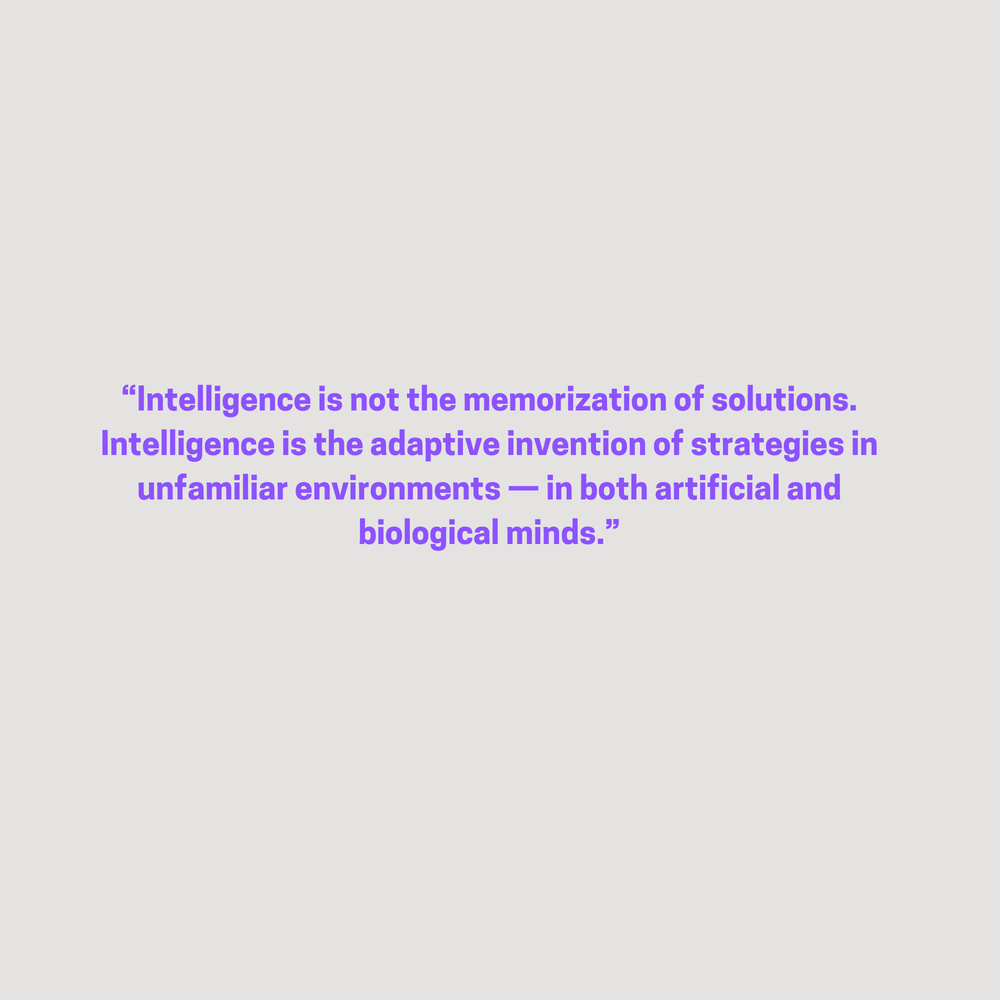

# ASRA — Adaptive Scientific Reasoning Architecture

> *Intelligence as adaptive strategy formation in unfamiliar environments*

A 14-section technical presentation for AI engineers, researchers, cognitive scientists, and anyone building systems that must **invent** strategies — not merely recall them.



<figure>
  <video controls playsinline preload="metadata" poster="./asra-intelligence-quote.png">
    <source src="./asra-intelligence.mp4" type="video/mp4" />
    Your browser does not support embedded video. You can also watch the
    <a href="./asra-intelligence.mp4">full presentation recording</a>.
  </video>
  <figcaption>Full presentation with voiceover · Ilakkuvaselvi (Ilak) Manoharan · May 2026</figcaption>
</figure>

---

## 1. What Is Intelligence?

IQ tests and benchmarks measure performance on **known** tasks. True intelligence emerges when an agent can **adapt**, **generalize**, and **reason** in environments it has never seen before.

```
┌─────────────────────┐              ┌─────────────────────┐
│    MEMORIZATION     │      ≠       │     ADAPTATION      │
│  Lookup · replay    │              │  Explore · invent   │
│  Benchmark tricks   │              │  Novel strategies   │
│  Fails on novelty   │              │  Thrives on novelty │
└─────────────────────┘              └─────────────────────┘
```

- **Memorization** is not intelligence: recalling solutions ≠ understanding environments.
- Children, scientists, and explorers share one pattern: **hypothesis → experiment → abstraction → reuse**.
- Evolution is adaptive strategy search under uncertainty — not a lookup table.
- Survival, discovery, and play all reward **invention under uncertainty**.

> **Key Insight:** A lookup system can ace a benchmark. An intelligent system can walk into an unfamiliar room and figure out what to do.

---

## 2. The Limitations of Modern AI

Many systems **appear** intelligent yet fail under novelty — distribution shift, hidden rules, and tasks that require invention rather than recall.

| Pattern | Limitation |
|---------|------------|
| Supervised learning | Bound to training distribution |
| Next-token prediction | Plausible text ≠ causal world models |
| RLHF | Alignment ≠ exploration or discovery |
| Benchmark optimization | Shortcut learning · brittle generalization |

**Why ARC-style tasks matter:** They test whether a system can infer **hidden rules** and transfer abstractions — not whether it has seen similar puzzles before.

```
LLM pipeline:     Train → Predict → Respond     (fixed policy)
ASRA loop:        Explore → Hypothesize → Test → Abstract → Reuse
```

- Hallucinations reveal missing grounding: the model never had to **discover** how the world works.
- Poor causal reasoning and weak abstraction transfer show up exactly when environments change.

> **Production Reality:** A chatbot can sound brilliant on familiar prompts and fail completely on a novel puzzle with simple latent rules.

---

## 3. What Is ASRA?

**Adaptive Scientific Reasoning Architecture (ASRA)** is not merely a model. It is a **cognitive architecture** — a reasoning framework, exploration system, and adaptive strategy engine.

ASRA treats reasoning as **active scientific discovery**, not passive prediction:

```
        ┌──────────┐
        │ Observe  │
        └────┬─────┘
             ▼
      ┌──────────────┐
      │  Hypothesize │
      └──────┬───────┘
             ▼
      ┌──────────────┐
      │  Experiment  │
      └──────┬───────┘
             ▼
      ┌──────────────┐
      │    Learn     │
      └──────┬───────┘
             ▼
      ┌──────────────┐
      │   Abstract   │──────▶ Reuse in new environments
      └──────────────┘
```

- Environments are **puzzles** with hidden mechanics waiting to be reverse-engineered.
- Success means **transfer**: abstractions and strategies that work beyond the training set.
- ASRA is the architectural bet that **fluid intelligence** looks like science, not autocomplete.

---

## 4. The Core Principles of ASRA

### 4.1 Exploration Before Exploitation

Curiosity-driven learning, uncertainty reduction, and intrinsic motivation — **explore before committing** to a strategy.

Connections: Bayesian exploration, information gain, novelty search, hierarchical RL.

### 4.2 Hidden Mechanics Discovery

Unknown action semantics, latent rules, emergent structure — reverse-engineer the environment like a scientist in an unfamiliar lab.

Connections: causal discovery, world-model learning, interventionist reasoning.

### 4.3 Rapid Abstraction Formation

Concept formation, symbolic compression, reusable mental models — the ladder from raw experience to **transferable** structure.

```
Raw experience → Patterns → Concepts → Symbols → Compositional reasoning
```

### 4.4 Adaptive Strategy Synthesis

Dynamic policy creation, meta-reasoning, recursive planning — invent strategies rather than retrieve them.

Analogies: chess improvisation, experimental design, robotics in unstructured worlds.

### 4.5 Memory as Structured Scientific Knowledge

| Memory type | Role |
|-------------|------|
| Episodic | What happened, in context |
| Semantic | What is generally true |
| Procedural | How to act |
| Causal | What causes what |
| Hypothesis | What might be true (pending test) |

Memory is a **graph** for reasoning — not a flat context window.

---

## 5. ASRA System Architecture

```
┌─────────────────────────────────────────┐
│     Reflection & Self-Evaluation        │
├─────────────────────────────────────────┤
│        Strategy Synthesizer             │
├─────────────────────────────────────────┤
│         Abstraction Engine              │
├─────────────────────────────────────────┤
│         Exploration Engine              │
├─────────────────────────────────────────┤
│        Hypothesis Generator             │
├─────────────────────────────────────────┤
│       Environment Interpreter           │
└─────────────────────────────────────────┘
```

**Supporting modules:** World Model · Memory Graph · Meta-Reasoner · Uncertainty Estimator · Tool Interface Layer.

Data flows in a **cognition loop**: perceive → hypothesize → act → observe → update → abstract → plan again.

---

## 6. ASRA vs Current AI Systems

| Capability | LLM | RL agent | ASRA |
|------------|-----|----------|------|
| Language fluency | Strong | Weak | Varies |
| Fixed-game mastery | Weak | Strong | Varies |
| Open-ended exploration | Weak | Medium | **Core** |
| Hidden rule discovery | Weak | Medium | **Core** |
| Abstraction & transfer | Medium | Medium | **Core** |
| Causal reasoning | Weak | Medium | **Designed for** |
| Sample efficiency on novelty | Weak | Medium | **Target** |

LLMs excel at language. RL agents excel at fixed simulators. **ASRA targets environments where the rules are not given.**

---

## 7. Connections to Advanced AI Research

ASRA sits at the intersection of multiple research threads:

- **ARC Prize / AGI benchmarks** — generalization on novel tasks, not memorization
- **Active inference & predictive processing** — minimize surprise through action and model update
- **World models** — simulate before acting (Dreamer, JEPA, etc.)
- **Meta-learning** — learn how to learn new tasks quickly
- **Neuro-symbolic systems** — combine vectors with compositional structure
- **Program synthesis & induction** — strategies as executable structure
- **Intrinsic motivation** — reward exploration, not only external score

> **Key Insight:** ASRA is not competing with every approach — it **composes** the pieces that matter for adaptation under uncertainty.

---

## 8. ASRA and the Scientific Method

The scientific method is not a human quirk. It is a **compression algorithm for reality**:

```
Observe → Hypothesize → Experiment → Learn → Abstract → Reuse
```

The same loop drives:

- **Children** learning physics through play
- **Scientists** discovering laws through intervention
- **Explorers** mapping unknown territories
- **Evolution** selecting strategies that reproduce

ASRA **operationalizes** this loop as computational architecture — not as a metaphor.

---

## 9. Multi-Environment Generalization

True intelligence requires thriving when the **training distribution ends**.

```
Training env A  ──✕──▶  Novel env B     (memorization fails)
Training env A  ──────▶  Novel env B     (ASRA adapts: new strategy)
```

Examples:

- **Robotics** — new objects, lighting, physics
- **Games** — new rules without retraining from scratch
- **Science** — new instruments, new phenomena
- **Autonomous systems** — open-world deployment

Few-shot adaptation, domain transfer, and continual learning are not optional features — they are **the test** of intelligence.

---

## 10. Advanced Topics

For researchers and systems engineers:

- Meta-learning and online adaptation
- Causal inference and program induction
- Uncertainty estimation and active inference
- Graph reasoning and symbolic abstraction
- Intrinsic rewards and hierarchical planning
- Continual learning and catastrophic forgetting
- Self-reflection and bounded recursive improvement
- Information-theoretic exploration
- Self-generated curricula and environment decomposition

> **Advanced Note:** ASRA-scale systems will need explicit **uncertainty** and **safety** layers — exploration without reflection is dangerous at civilization scale.

---

## 11. The Future of AI

Scaling alone may not yield AGI. The next wave may look more like **scientists** than **chatbots**:

- Autonomous scientific agents designing and running experiments
- Robotic explorers discovering mechanics in physical worlds
- Adaptive reasoning substrates that **invent** strategies on demand
- Self-improving cognition with reflection guardrails

The question shifts from *"What was in the training data?"* to *"What can you figure out that was not?"*

---

## 12. Why This Matters

Adaptive intelligence changes what is possible across:

- **Science** — hypothesis generation at unprecedented scale
- **Medicine** — models that adapt to individual biology
- **Education** — tutors that invent teaching strategies per learner
- **Climate & engineering** — discovery of interventions, not only prediction
- **Autonomous systems** — safe operation in open worlds

Memorization scales with data. **Adaptation scales with architecture.**

---

## 13. Conclusion — Intelligence as Invention

> **Intelligence is not the memorization of solutions. Intelligence is the adaptive invention of strategies in unfamiliar environments.**

ASRA is a direction of travel:

- **Reasoning** as exploration
- **Abstraction** as the foundation of generalization
- **Strategy synthesis** as the signature of minds — artificial and biological alike

```
  ┌──────────┐      ┌─────────────┐      ┌──────────┐      ┌──────────┐
  │ Observe  │ ───▶ │ Hypothesize │ ───▶ │ Experiment│ ───▶ │  Adapt   │
  └──────────┘      └─────────────┘      └──────────┘      └──────────┘
```

This is a foundational manifesto for **adaptive intelligence systems** — systems that earn the word *intelligent* by what they do in the unfamiliar, not what they repeat from the past.

---

*This presentation is also available as an interactive web experience at [/presentations/asra-intelligence](/presentations/asra-intelligence).*
