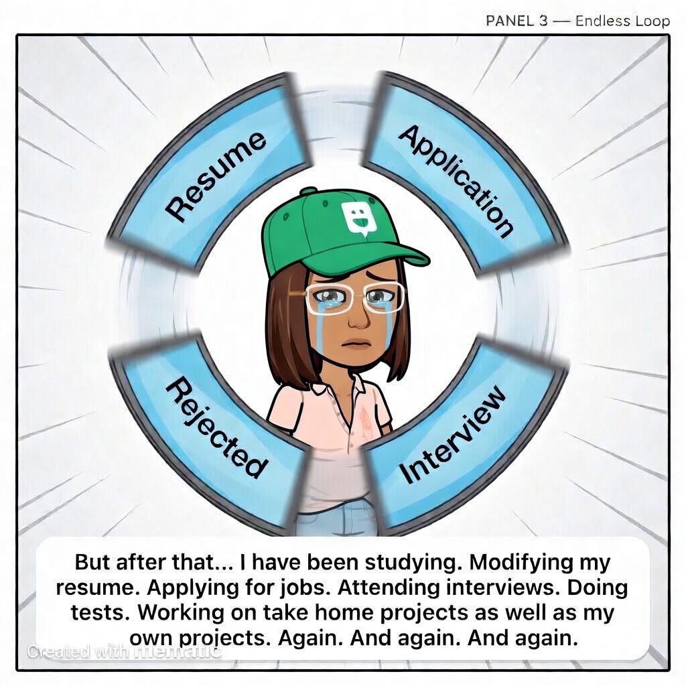
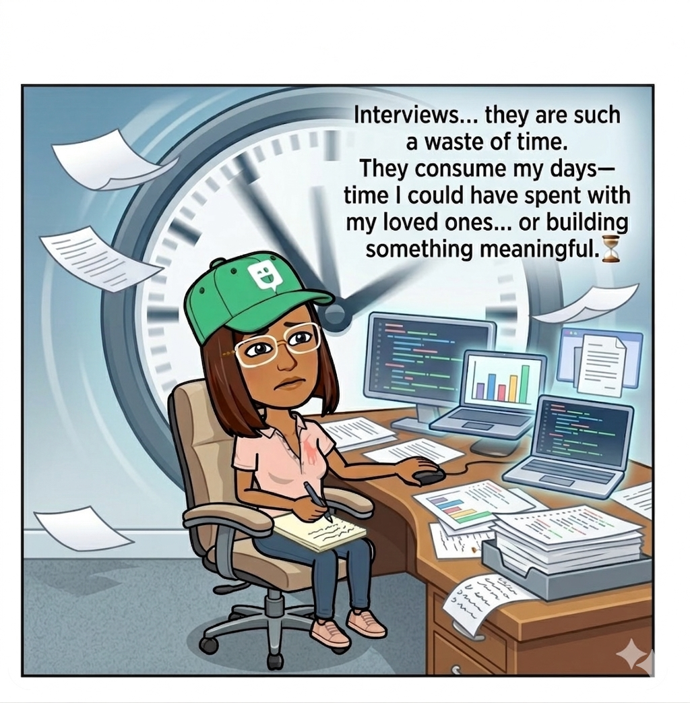
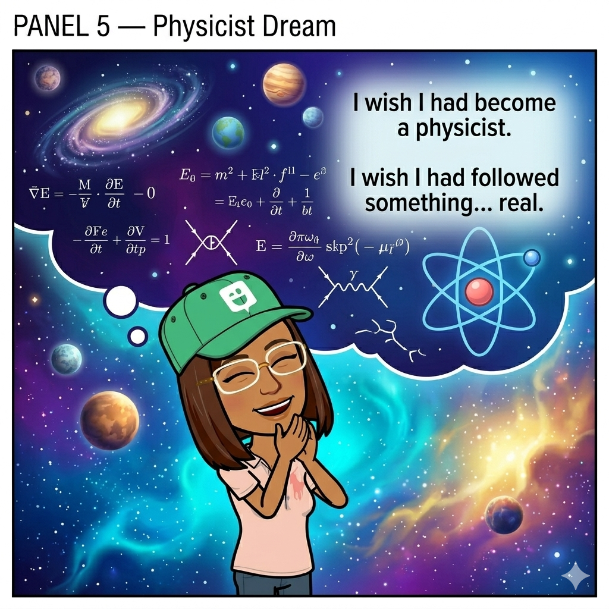
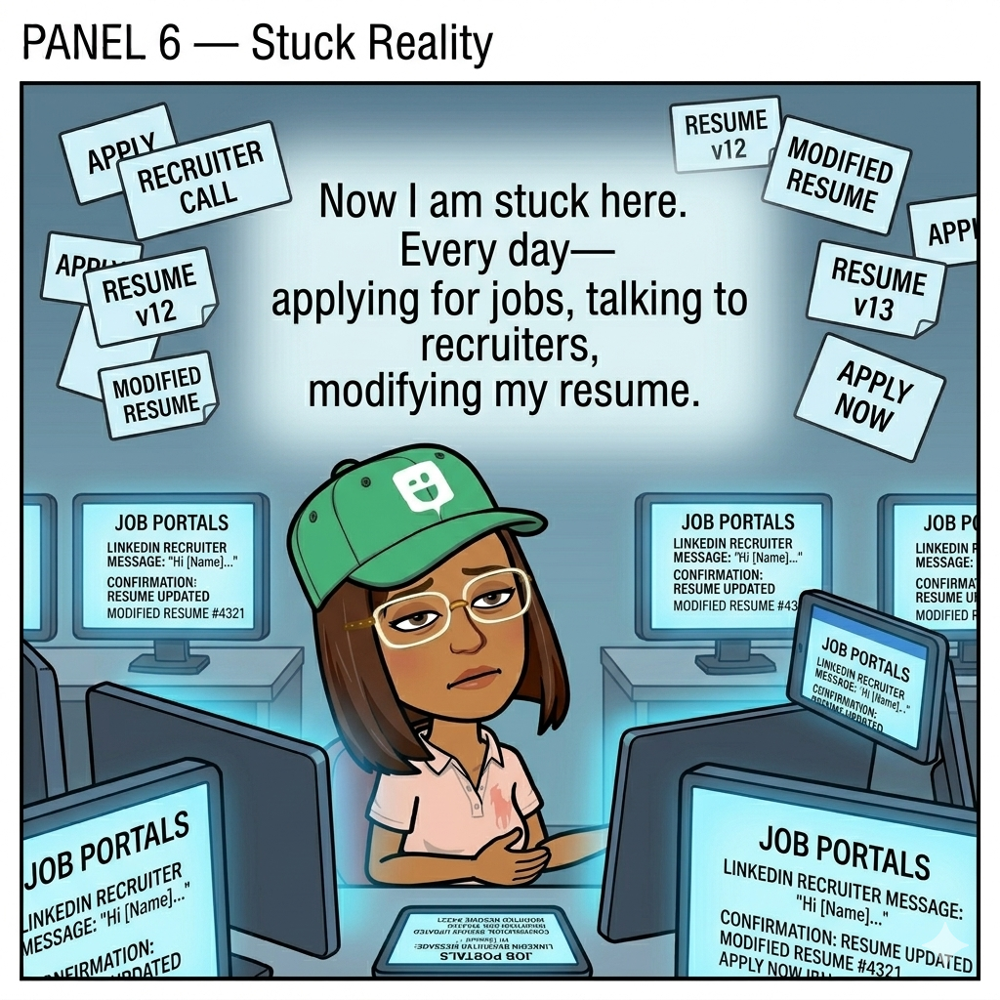
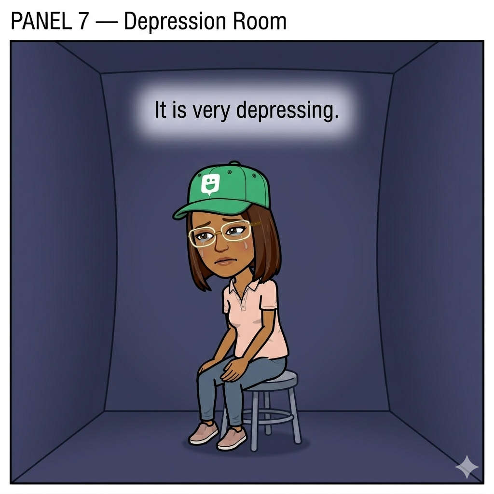
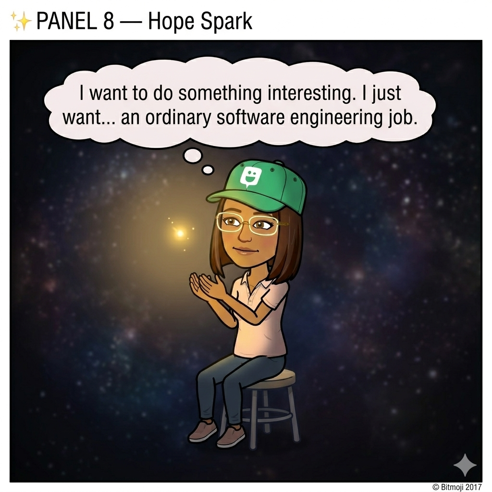
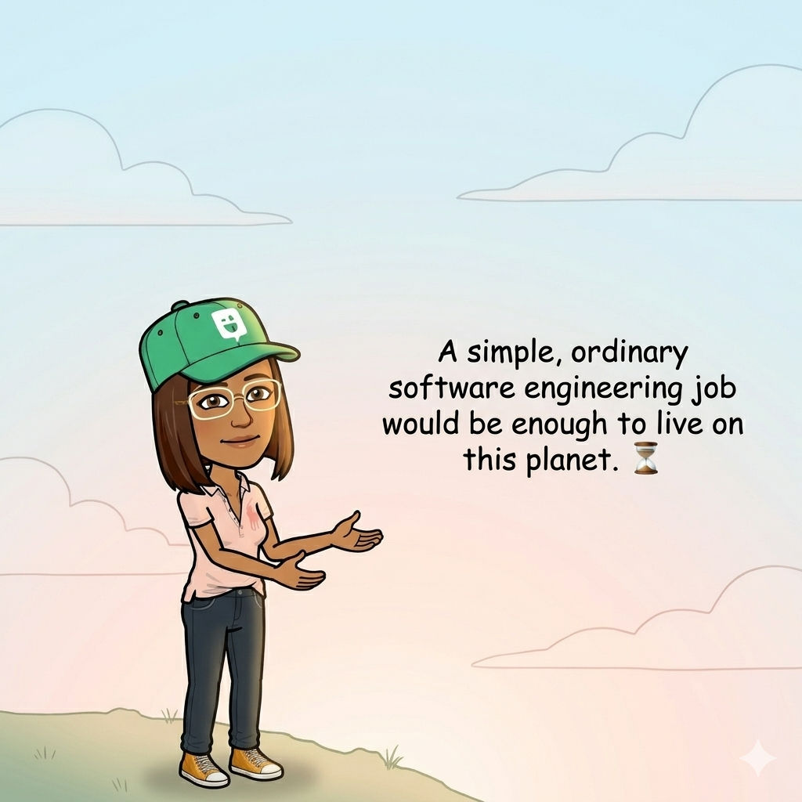
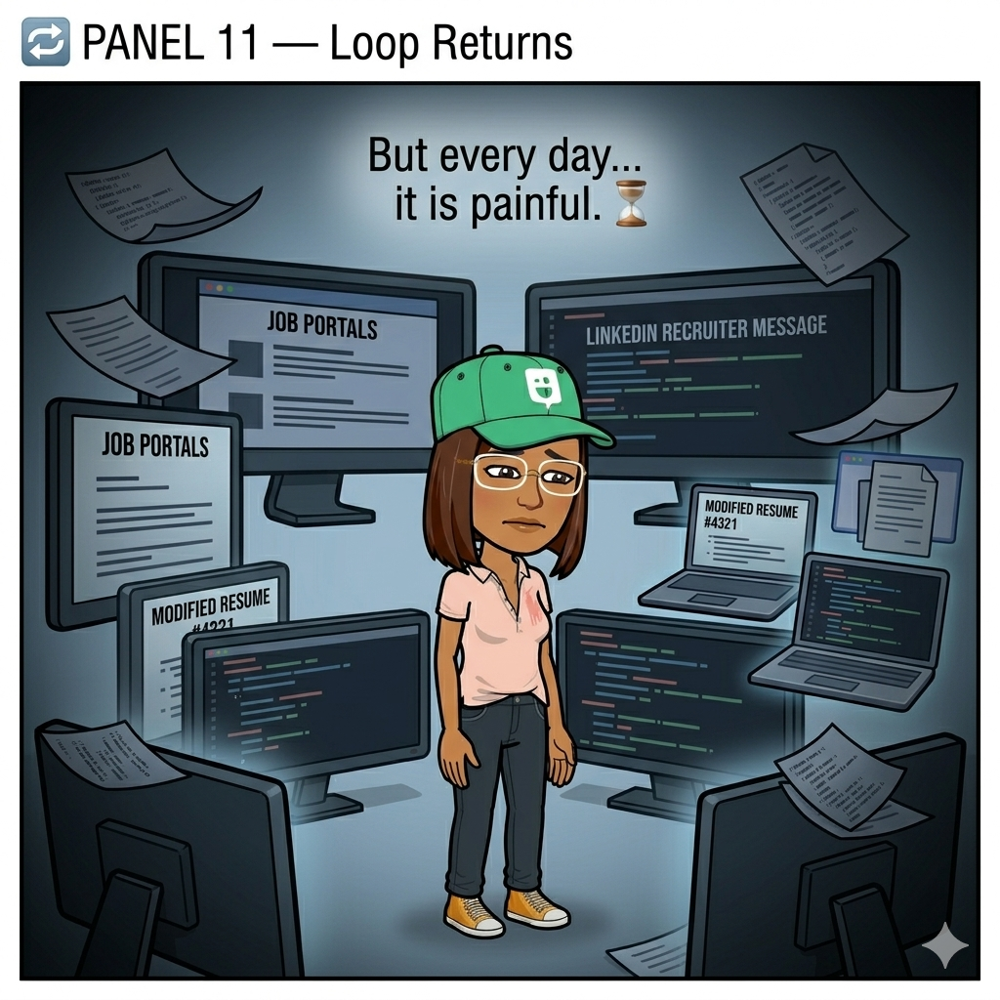
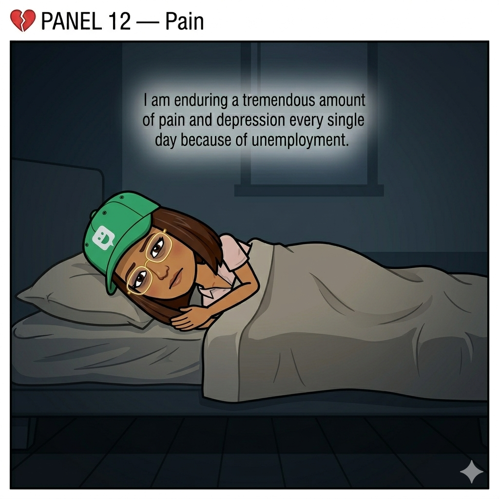

---
# Optional Publish Desk block for GitHub sync — see private/article-template.md comments in repo docs or remove this fence entirely for default sync behavior.

publish_desk_active: true

author: "ilak"
status: "published"
createdAt: "2026-03-29"
updatedAt: "2026-03-29"

publish_desk:
  # Display title
  title: "Planet Impossible — Issue #1: The Endless Loop"
  # URL slug (optional)
  slug: planet-impossible-issue-1-the-endless-loop
  # Listing excerpt (optional)
  excerpt: "A story about effort, rejection, and the quiet fight to keep going."
  # Category slug (sync creates category if needed)
  category: comics
  tags:
    - career
    - struggle
    - software engineering
    - life
    - comics
  # true = premium-only (`premiumOnly` on content). Omit or false = free.
  premium: false
  # Magazine slugs from your dashboard; one article can list many magazines.
  magazines:
    - planet-impossible
---

# 🪐 Planet Impossible  
## Issue #1: The Endless Loop

> *A story about effort, rejection, and the quiet fight to keep going.*

